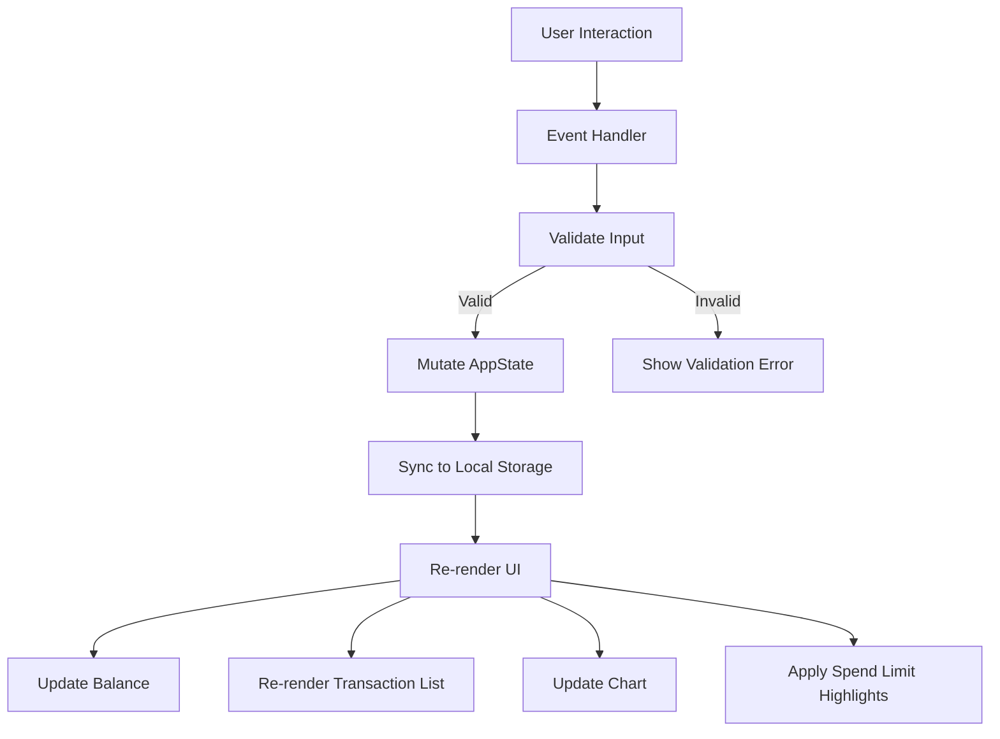

# Design Document

## Overview

The Expense & Budget Visualizer is a single-page, client-side web application built with plain HTML, CSS, and vanilla JavaScript. It allows users to record spending transactions, visualise category breakdowns via a Chart.js pie chart, and manage a running total balance — all without a backend or build step. Data is persisted entirely in the browser's Local Storage.

The application is structured as three files:

- `index.html` — markup and Chart.js CDN script tag
- `css/styles.css` — all styling, including responsive breakpoints and theme variables
- `js/app.js` — all application logic

The design prioritises simplicity: no module bundler, no transpiler, no framework. The JS file uses a straightforward module pattern (IIFE or top-level functions) to keep global scope clean.

---

## Architecture

The app follows a **unidirectional data flow** pattern:

```
User Action → State Mutation → Storage Sync → UI Re-render
```

All application state lives in a single in-memory object (`AppState`). Every user action (add transaction, delete transaction, change sort, set spend limit, toggle theme) mutates `AppState`, writes the relevant slice to Local Storage, then calls a render function that rebuilds the affected UI components from the current state.



### Key Design Decisions

- **No virtual DOM / diffing**: The transaction list is fully re-rendered on every state change. With the expected data volume (tens to low hundreds of transactions), this is fast enough and avoids complexity.
- **Chart.js instance reuse**: A single `Chart` instance is created on load and updated via `chart.data` mutation + `chart.update()` rather than destroying and recreating it, which avoids flicker.
- **CSS custom properties for theming**: Light/dark mode is implemented by toggling a `data-theme` attribute on `<html>` and defining all colours as CSS variables. No JS style manipulation is needed beyond the attribute toggle.
- **Sort is view-only**: Sorting never mutates the stored array. The render function sorts a shallow copy before building the list DOM.

---

## Components and Interfaces

### HTML Structure (`index.html`)

```
<html data-theme="light">
  <head> … </head>
  <body>
    <header>
      <h1>Expense & Budget Visualizer</h1>
      <button id="theme-toggle">🌙 Dark Mode</button>
    </header>

    <main>
      <!-- Balance -->
      <section id="balance-section">
        <span id="balance-display">$0.00</span>
      </section>

      <!-- Input Form -->
      <section id="form-section">
        <form id="transaction-form">
          <input id="item-name" type="text" placeholder="Item name" />
          <input id="item-amount" type="number" min="0.01" step="0.01" placeholder="Amount" />
          <select id="item-category">
            <option value="">Select category</option>
            <option value="Food">Food</option>
            <option value="Transport">Transport</option>
            <option value="Fun">Fun</option>
          </select>
          <button type="submit">Add</button>
          <p id="form-error" role="alert" aria-live="polite"></p>
        </form>
      </section>

      <!-- Spend Limit -->
      <section id="spend-limit-section">
        <input id="spend-limit-input" type="number" min="0.01" step="0.01" placeholder="Spend limit per category" />
        <button id="set-limit-btn">Set Limit</button>
        <p id="limit-error" role="alert" aria-live="polite"></p>
      </section>

      <!-- Chart -->
      <section id="chart-section">
        <canvas id="spending-chart"></canvas>
        <p id="chart-placeholder">No transactions yet.</p>
      </section>

      <!-- Sort Controls + Transaction List -->
      <section id="list-section">
        <div id="sort-controls">
          <label for="sort-select">Sort by:</label>
          <select id="sort-select">
            <option value="default">Default</option>
            <option value="amount-asc">Amount ↑</option>
            <option value="amount-desc">Amount ↓</option>
            <option value="category-az">Category A–Z</option>
          </select>
        </div>
        <ul id="transaction-list" aria-label="Transaction history"></ul>
        <p id="empty-state">No transactions recorded.</p>
      </section>
    </main>
  </body>
</html>
```

### JavaScript Module Interface (`js/app.js`)

All functions are module-scoped (inside an IIFE). The public surface is only the event listeners attached to DOM elements.

| Function | Responsibility |
|---|---|
| `init()` | Load state from Local Storage, render all UI, attach event listeners |
| `addTransaction(name, amount, category)` | Validate, push to `AppState.transactions`, sync, render, clear and focus form |
| `deleteTransaction(id)` | Remove from `AppState.transactions`, sync, render |
| `setSpendLimit(value)` | Validate, set `AppState.spendLimit`, sync, render |
| `setSortOrder(order)` | Set `AppState.sortOrder`, render list only |
| `toggleTheme()` | Flip `AppState.theme`, sync, apply `data-theme` attribute to `<html>` |
| `renderAll()` | Call all render sub-functions |
| `renderBalance()` | Recompute and display total |
| `renderList()` | Sort copy, build `<li>` elements, apply highlights |
| `renderChart()` | Aggregate by category, update Chart.js instance |
| `validateTransactionForm()` | Return `{valid, errors}` |
| `validateSpendLimit(value)` | Return `{valid, error}` |
| `loadState()` | Read and parse Local Storage keys |
| `saveTransactions()` | Serialise `AppState.transactions` to Local Storage under key `ebv_transactions` |
| `saveSpendLimit()` | Write `AppState.spendLimit` to Local Storage under key `ebv_spend_limit` |
| `saveTheme()` | Write `AppState.theme` to Local Storage under key `ebv_theme` |

### CSS Architecture (`css/styles.css`)

- **CSS custom properties** on `:root` and `[data-theme="dark"]` for all colours
- **Flexbox** layout for the main column; **CSS Grid** for the form row on desktop
- **Media queries**:
  - `(max-width: 428px)` — single-column mobile layout (covers the 320px–428px range specified in Requirement 9.1)
  - `(min-width: 1024px)` — expanded desktop layout (Requirement 9.2)
- **`.over-limit`** class applied to `<li>` elements when category exceeds spend limit

---

## Data Models

### AppState (in-memory)

```js
const AppState = {
  transactions: [],     // Transaction[]
  spendLimit: null,     // number | null
  sortOrder: 'default', // 'default' | 'amount-asc' | 'amount-desc' | 'category-az'
  theme: 'light',       // 'light' | 'dark'
  chart: null,          // Chart.js instance
};
```

### Transaction Object

```js
{
  id: string,        // crypto.randomUUID() or Date.now().toString()
  name: string,      // item name, non-empty, trimmed
  amount: number,    // positive float, stored as number
  category: string,  // 'Food' | 'Transport' | 'Fun'
  createdAt: number, // Date.now() timestamp for stable insertion order
}
```

### Local Storage Keys

| Key | Value | Description |
|---|---|---|
| `ebv_transactions` | JSON string of `Transaction[]` | All transactions (Requirement 5.1–5.3) |
| `ebv_spend_limit` | Numeric string or absent | Current spend limit (Requirement 5.4) |
| `ebv_theme` | `'light'` or `'dark'` | Last selected theme (Requirement 5.5) |

### Category Colour Map

```js
const CATEGORY_COLORS = {
  Food:      '#FF6384',
  Transport: '#36A2EB',
  Fun:       '#FFCE56',
};
```

---

## Correctness Properties

*A property is a characteristic or behavior that should hold true across all valid executions of a system — essentially, a formal statement about what the system should do. Properties serve as the bridge between human-readable specifications and machine-verifiable correctness guarantees.*

### Property 1: Transaction addition grows the list with unique identity

*For any* valid transaction (non-empty name, positive amount, valid category), adding it to the app should increase the transaction list length by exactly one, the new transaction should have a unique ID not shared by any other transaction, and a numeric `createdAt` timestamp.

**Validates: Requirements 1.1, 1.2**

---

### Property 2: Whitespace-only and empty names are rejected

*For any* string composed entirely of whitespace characters (or the empty string) used as an item name, the form validation should reject the submission and leave the transaction list unchanged.

**Validates: Requirements 1.3**

---

### Property 3: Non-positive amounts are rejected

*For any* numeric value that is zero or negative, or any non-numeric string, the form validation should reject the submission and leave the transaction list unchanged.

**Validates: Requirements 1.4**

---

### Property 4: Form is cleared after successful transaction addition

*For any* valid transaction (non-empty name, positive amount, valid category), after it is successfully added the item name input, amount input, and category select should all be reset to their empty/default values.

**Validates: Requirements 1.6**

---

### Property 5: Balance equals sum of all transaction amounts

*For any* collection of transactions (including the empty collection), the displayed balance should equal the arithmetic sum of all transaction amounts in that collection. This invariant holds after every add and delete operation, and equals $0.00 when the collection is empty.

**Validates: Requirements 3.1, 3.2, 3.3, 3.4**

---

### Property 6: Transaction persistence round-trip

*For any* sequence of add and delete operations on transactions, serialising `AppState.transactions` to Local Storage under the key `ebv_transactions` and then deserialising it back (simulating a page reload) should produce an array that is deeply equal to the current in-memory transactions array.

**Validates: Requirements 5.1, 5.2, 5.3**

---

### Property 7: Delete removes exactly one transaction

*For any* collection of transactions and any valid transaction ID in that collection, deleting that transaction should reduce the list length by exactly one, the deleted transaction's ID should no longer appear in the list, and all other transactions should remain unchanged.

**Validates: Requirements 2.3, 3.3**

---

### Property 8: Transaction card renders all required fields

*For any* transaction object, the rendered HTML card should contain the item name, the formatted amount, the category label, and a delete button element.

**Validates: Requirements 2.4**

---

### Property 9: Category totals are correctly aggregated

*For any* collection of transactions, the sum of all per-category totals should equal the overall balance, and each individual category total should equal the sum of amounts for transactions belonging to that category.

**Validates: Requirements 4.1, 4.2**

---

### Property 10: Sorting is correct and does not mutate stored data

*For any* collection of transactions and any of the four sort orders (`default`, `amount-asc`, `amount-desc`, `category-az`), the rendered list should appear in the correct order for that sort, and `AppState.transactions` should remain in its original insertion order after sorting is applied.

- `default`: transactions appear in ascending `createdAt` order (oldest first)
- `amount-asc`: each adjacent pair satisfies `a.amount <= b.amount`
- `amount-desc`: each adjacent pair satisfies `a.amount >= b.amount`
- `category-az`: each adjacent pair satisfies `a.category <= b.category` (lexicographic)

**Validates: Requirements 6.1, 6.2, 6.3, 6.4, 6.5**

---

### Property 11: Spend limit highlighting consistency

*For any* collection of transactions and any positive spend limit, every transaction whose category total exceeds the limit should have the `.over-limit` class applied, and every transaction whose category total does not exceed the limit should not have the `.over-limit` class applied. This invariant holds immediately after any change to the spend limit or transaction list.

**Validates: Requirements 7.2, 7.3, 7.4**

---

### Property 12: Invalid spend limit values are rejected

*For any* numeric value that is zero or negative, or any non-numeric string, the spend limit validation should reject the input and leave `AppState.spendLimit` unchanged.

**Validates: Requirements 7.5**

---

### Property 13: Theme toggle round-trip and DOM synchronisation

*For any* starting theme (`'light'` or `'dark'`), toggling the theme twice should return `AppState.theme` to its original value. At every point after a toggle, the `data-theme` attribute on `<html>` should equal `AppState.theme`.

**Validates: Requirements 8.1, 8.2**

---

### Property 14: Spend limit persistence round-trip

*For any* valid positive spend limit, saving it to Local Storage under the key `ebv_spend_limit` and reading it back should produce the same numeric value.

**Validates: Requirements 5.4, 5.6**

---

## Error Handling

| Scenario | Handling |
|---|---|
| Empty item name | Inline error below form: "Item name is required." |
| Whitespace-only item name | Inline error below form: "Item name is required." |
| Non-positive amount | Inline error: "Amount must be a positive number." |
| Non-numeric amount | Inline error: "Amount must be a positive number." |
| Empty category selection | Inline error: "Please select a category." |
| Invalid spend limit | Inline error: "Spend limit must be a positive number." Previous limit retained. |
| Local Storage unavailable | `try/catch` around all Storage calls; app continues in-memory with a console warning. |
| Local Storage data corrupt | `try/catch` around `JSON.parse`; corrupt data is discarded and Storage key is cleared. |
| Chart.js CDN unavailable | Chart section shows a static fallback message: "Chart unavailable." |

All validation errors are displayed in `role="alert"` paragraphs so screen readers announce them. Errors are cleared when the user begins correcting the relevant field.

---

## Testing Strategy

### Overview

The testing approach uses two complementary layers:

- **Property-based tests** — verify universal invariants across many randomly generated inputs using a PBT library
- **Example-based unit tests** — verify specific scenarios, edge cases, and integration points with concrete inputs

The property-based testing library chosen is **[fast-check](https://github.com/dubzzz/fast-check)** (JavaScript), loaded as a dev dependency or via CDN in the test environment. Each property test runs a minimum of **100 iterations**.

Since all application logic lives in `js/app.js` as pure or near-pure functions (validation, aggregation, sorting, serialisation), the core logic can be extracted and tested in isolation without a DOM. DOM-dependent render functions are tested with a lightweight DOM environment (e.g., jsdom via Jest, or a minimal HTML fixture).

---

### Property-Based Tests

Each test below corresponds to a Correctness Property in the design document. Tag format: `Feature: expense-budget-visualizer, Property N: <property text>`.

**Property 1 — Transaction addition grows the list with unique identity**
- Generator: arbitrary non-empty string (name), positive float (amount), one of `['Food', 'Transport', 'Fun']` (category)
- Action: call `addTransaction(name, amount, category)` on a fresh state
- Assertions: list length increased by 1; new item has a string `id` not present in prior IDs; `createdAt` is a finite number
- Tag: `Feature: expense-budget-visualizer, Property 1: transaction addition grows list with unique identity`

**Property 2 — Whitespace-only names are rejected**
- Generator: strings composed entirely of `' '`, `'\t'`, `'\n'`, `'\r'` (including empty string)
- Action: call `validateTransactionForm({ name: whitespaceStr, amount: 1, category: 'Food' })`
- Assertions: result is `{ valid: false }` and transaction list is unchanged
- Tag: `Feature: expense-budget-visualizer, Property 2: whitespace names rejected`

**Property 3 — Non-positive amounts are rejected**
- Generator: numbers ≤ 0 (including 0, negative integers, negative floats)
- Action: call `validateTransactionForm({ name: 'test', amount: nonPositive, category: 'Food' })`
- Assertions: result is `{ valid: false }` and transaction list is unchanged
- Tag: `Feature: expense-budget-visualizer, Property 3: non-positive amounts rejected`

**Property 4 — Form is cleared after successful transaction addition**
- Generator: arbitrary valid transaction inputs (non-empty name, positive amount, valid category)
- Action: call `addTransaction(name, amount, category)` and inspect form field values
- Assertions: `#item-name` value is `''`; `#item-amount` value is `''`; `#item-category` value is `''`
- Tag: `Feature: expense-budget-visualizer, Property 4: form cleared after successful add`

**Property 5 — Balance equals sum of all transaction amounts**
- Generator: arrays of 0–50 transactions with random positive amounts
- Action: call `computeBalance(transactions)`
- Assertions: result equals `transactions.reduce((sum, t) => sum + t.amount, 0)` (within floating-point tolerance); equals 0 for empty array
- Tag: `Feature: expense-budget-visualizer, Property 5: balance equals sum of amounts`

**Property 6 — Transaction persistence round-trip**
- Generator: arrays of 0–20 valid transactions
- Action: call `saveTransactions(transactions)` (writes to `ebv_transactions`) then `loadTransactions()`
- Assertions: loaded array is deeply equal to the saved array
- Tag: `Feature: expense-budget-visualizer, Property 6: transaction persistence round-trip`

**Property 7 — Delete removes exactly one transaction**
- Generator: non-empty arrays of transactions; pick a random index to delete
- Action: call `deleteTransaction(transactions[i].id)` on a copy of the array
- Assertions: result length is `original.length - 1`; deleted ID is absent; all other IDs are present
- Tag: `Feature: expense-budget-visualizer, Property 7: delete removes exactly one`

**Property 8 — Transaction card renders all required fields**
- Generator: arbitrary valid transaction objects
- Action: call `renderTransactionCard(transaction)` and parse the returned HTML string
- Assertions: output contains the transaction's `name`, formatted `amount`, `category`, and a delete button
- Tag: `Feature: expense-budget-visualizer, Property 8: card renders all required fields`

**Property 9 — Category totals are correctly aggregated**
- Generator: arrays of 0–30 transactions with random categories and amounts
- Action: call `aggregateByCategory(transactions)`
- Assertions: sum of all category totals equals total balance; each category total equals the sum of amounts for that category
- Tag: `Feature: expense-budget-visualizer, Property 9: category totals correctly aggregated`

**Property 10 — Sorting is correct and does not mutate stored data**
- Generator: arrays of 0–20 transactions; one of the four sort orders (`default`, `amount-asc`, `amount-desc`, `category-az`)
- Action: call `sortTransactions(transactions, sortOrder)` (operates on a copy)
- Assertions for `default`: order matches original insertion order (by `createdAt` ascending)
- Assertions for `amount-asc`: each adjacent pair satisfies `a.amount <= b.amount`
- Assertions for `amount-desc`: each adjacent pair satisfies `a.amount >= b.amount`
- Assertions for `category-az`: each adjacent pair satisfies `a.category <= b.category`
- Mutation check: original `transactions` array is unchanged after the call
- Tag: `Feature: expense-budget-visualizer, Property 10: sorting correct and non-mutating`

**Property 11 — Spend limit highlighting consistency**
- Generator: arrays of 0–20 transactions; positive spend limit
- Action: call `computeOverLimitIds(transactions, spendLimit)`
- Assertions: every ID in the result set belongs to a category whose total exceeds `spendLimit`; every ID not in the result set belongs to a category whose total does not exceed `spendLimit`
- Tag: `Feature: expense-budget-visualizer, Property 11: spend limit highlighting consistent`

**Property 12 — Invalid spend limit values are rejected**
- Generator: numbers ≤ 0; non-numeric strings
- Action: call `validateSpendLimit(invalidValue)`
- Assertions: result is `{ valid: false }`; `AppState.spendLimit` is unchanged
- Tag: `Feature: expense-budget-visualizer, Property 12: invalid spend limit rejected`

**Property 13 — Theme toggle round-trip and DOM synchronisation**
- Generator: starting theme `'light'` or `'dark'` (both cases)
- Action: call `toggleTheme()` twice from the starting theme
- Assertions: `AppState.theme` equals the original starting theme after two toggles; after each toggle, `document.documentElement.getAttribute('data-theme')` equals `AppState.theme`
- Tag: `Feature: expense-budget-visualizer, Property 13: theme toggle round-trip and DOM sync`

**Property 14 — Spend limit persistence round-trip**
- Generator: positive floats
- Action: call `saveSpendLimit(value)` (writes to `ebv_spend_limit`) then `loadSpendLimit()`
- Assertions: loaded value equals saved value (within floating-point tolerance)
- Tag: `Feature: expense-budget-visualizer, Property 14: spend limit persistence round-trip`

---

### Example-Based Unit Tests

These cover specific scenarios not fully addressed by property tests:

| Test | Scenario | Expected Result |
|---|---|---|
| Empty category validation | Submit form with no category selected (empty string) | Error message shown; list unchanged |
| Empty state message | Render list with zero transactions | `#empty-state` element is visible |
| Chart placeholder | Render chart with zero transactions | `#chart-placeholder` visible; canvas hidden |
| Category colours | Read `CATEGORY_COLORS` map | Food, Transport, Fun each have distinct hex values |
| Default theme on fresh load | Clear localStorage, call `init()` | `AppState.theme` is `'light'` and `data-theme` is `'light'` |
| Theme restored on reload | Store `'dark'` in `ebv_theme`, call `init()` | `AppState.theme` is `'dark'` and `data-theme` is `'dark'` |
| Theme persisted on toggle | Toggle theme, read `ebv_theme` from localStorage | `localStorage['ebv_theme']` equals `AppState.theme` |
| Corrupt localStorage recovery | Store invalid JSON in `ebv_transactions`, call `loadState()` | App starts with empty transaction list; no crash |
| Chart.js CDN fallback | Simulate `Chart` constructor unavailable | Fallback message "Chart unavailable." is displayed |
| Valid spend limit accepted | Enter `50` in spend limit field, confirm | `AppState.spendLimit` is `50` |

---

### Integration Tests

These verify end-to-end wiring that cannot be tested with pure logic:

| Test | Scenario |
|---|---|
| Full add → persist → reload cycle | Add 3 transactions, simulate page reload, verify all 3 are restored from `ebv_transactions` |
| Chart renders with all categories | Add one transaction per category, verify Chart.js instance has 3 data points |
| Spend limit triggers re-render | Set spend limit below one category total, verify `.over-limit` class appears on correct cards |
| Delete updates balance and chart | Delete a transaction, verify balance and chart data points update correctly |

---

### Manual / Visual Tests

| Test | Viewport |
|---|---|
| Mobile single-column layout | 375px wide (within 320px–428px range) |
| Desktop expanded layout | 1280px wide (≥ 1024px) |
| Dark mode visual appearance | Any viewport |
| Responsive transition at breakpoints | Resize from 375px to 1280px |
